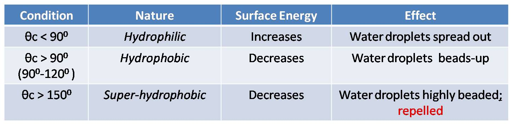

<h2>Contact Angle</h2>  
When we rest a small droplet on the solid surface, liquid vapor interface forms contact angle with the solid surface or tangential outline of the droplet on the solid forms the contact angle. It is a quantitative measure of the wetting of a solid by a liquid, surface tension, cleanliness and adhesion.Hydrophobicity and hydrophilicity characters of the surface can also be determined. Contact angle hysteresis is used to characterize the roughnes, mobility and heterogenity.Contact angle hysteresis is the difference between maximum contact angle and minimum contact angle values. Since thermodynamics of materials is considered in terms of measuring contact angle, the analysis is based on the interfacial free energies between the three faces.  
Contact angle can be written as:-  
Cos θ(c )=γsv-γsl/γlv 
Where,' cosθc ' is the contact angle (cosθ) 
'γsv' is the interfacial energies of solid and vapour 
'γsl' is the interfacial energies of solid and liquid 
'γlv' is the interfacial energies of liquid and vapour.  
<h2>Wetting and nonwetting :</h2>  
When a liquid is dropped on the solid surface, two extreme cases are considered while measuring contact angle. The contact angle ranges from 0 to 180 .If the droplet is strongly attached to the solid which is hydrophilic in nature, the liquid is completely spread out on the solid surface, the contact angle is equal to 0-30 or the liquid film is formed on the solid surface, (it is said that perfect wetting exists). Highly hydrophilic solids will have contact angle ranges from 0-30 and for less hydrophilic solids will have contact angle of about 90.In other case, the droplet is weakly attached to the solid surface and the contact angle will be above 120or the liquid forms a sphere on the solid surface, (perfect nonwetting occurs on the surface).  
<b>Dynamic and equilibrium contact angle :</b>  
If the contact angle is measured when either the liquid drop still spreads or its thermodynamic state conditions still change, the measured contact angle is called the dynamic contact angle. However, if the contact angle is measured under the conditions that the liquid drop is stationary and the surrounding conditions are at the steady state, the measured contact angle is called the static/equilibrium contact angle. Theoretically, the dynamic contact angle is more related to the hydrodynamic conditions, whereas the equilibrium contact angle depends on the surface properties of the solid-liquid-vapor system under given thermodynamic conditions. Unless otherwise specified, only the equilibrium contact angles will be discussed in this article, although most experimental techniques are applicable for measuring both the equilibrium and dynamic contact angles.  
<b>Classification of surfaces:</b>  
Surface can be classified on the basis of contact angle(CA;θc). 
  
Development of Superhydrophobic Surfaces: 
1) Materials with lowest surface energy; CA ~ 120o is obtained. 
2) Thus, for hydrophobic surfaces, an increased surface roughnes enhance the CA. 
3) therefore, Superhydrophobicity is the combination of surface chemistry (hydrophobicity) and structure (roughness).  
 
Various contact angle Measuring Methods:
(1) Static sessile drop method (contact angle)
(2) Dynamic sessile drop method (contact hysteresis)
(3) Powder contact angle method
(4) Dynamic Wilhelmy method
(5) Single-fiber Wilhelmy method

Factors affecting the contact angle:-
(1) Roughness
(2) Functional group present on the surface
(3) Impurities
(4) Porosity
(5) Surface Energy

